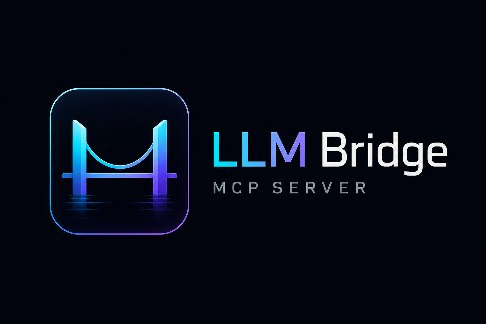

# LLM-bridge-mcp-server

<p align="center">
  
</p>

<p align="center">
  
  
  
  
</p>

`LLM-bridge-mcp-server` is a local-first MCP server that lets Codex, Claude Desktop, and other MCP-compatible hosts use GLM-family and compatible LLM providers as knowledge consultants, reasoning specialists, UI auditors, repository inspectors, and approval-gated development assistants.

The project started as a thin model bridge. It now exposes a safer orchestration layer around provider requests, persistent context, bounded agent loops, repository memory, workflows, jobs, and approval-controlled file changes. The host remains the primary controller at every stage.

For installation and package metadata, the npm package name remains lowercase and scoped: `@magnexis/llm-bridge-mcp-server`. The GitHub repository and display branding use `LLM-bridge-mcp-server`.

Release guide: [RELEASE.md](./RELEASE.md)

## Why this project exists

Most model bridges either stop at plain prompting or overreach into unrestricted autonomy. This server is built around a narrower and more practical middle ground:

- strong MCP compatibility
- explicit security boundaries
- local-first persistence
- approval-driven mutation
- auditable orchestration
- provider-aware LLM integration

## Architecture

```text
MCP host
  -> strict Zod-validated tool input
  -> MCP server registration layer
  -> provider-aware GLM client / local orchestration services
  -> local persistence, policy, workflow, and approval stores
  -> approval-gated file mutation and allowlisted command execution
```

The compiled entry point is `dist/index.js`, and `npm start` launches `node dist/index.js`.

The server supports both local stdio MCP hosting and remote HTTP MCP hosting. Use `GLM_BRIDGE_TRANSPORT_MODE=stdio` for local hosts like Codex or Claude Desktop, or `GLM_BRIDGE_TRANSPORT_MODE=http` to expose a remote streamable HTTP MCP endpoint.

Compatibility note: the project branding is now `LLM-bridge-mcp-server`, while the existing public MCP tool names, resource URIs, prompts, and `GLM_BRIDGE_*` environment variables remain stable for backward compatibility.

Release artifacts included in this repository:

- `package.json` for npm publication
- `server.json` for MCP Registry metadata
- `manifest.json` as a desktop-extension packaging manifest scaffold
- `LICENSE` and `CHANGELOG.md` for release distribution

For `npx`-style launch flows, publish the executable CLI package as:

```bash
npx @magnexis/llm-bridge-mcp-server
```

## Feature matrix

| Capability | Status |
|---|---|
| Knowledge consultation | Implemented |
| Deep reasoning | Implemented |
| Vision/UI auditing | Implemented |
| Smart routing | Implemented |
| Controlled read-only agent loop | Implemented |
| Persistent contexts | Implemented |
| Persistent sessions | Implemented |
| Repository memory | Implemented |
| Approval-gated file changes | Implemented |
| Checkpoint and rollback | Implemented |
| Allowlisted approved commands | Implemented |
| Roles and orchestration jobs | Implemented |
| Workflow registry and runner | Implemented |
| Workspace inspection | Implemented |
| Restricted network retrieval | Implemented, disabled by default |
| Streamable HTTP MCP transport | Implemented |
| Legacy SSE MCP compatibility endpoint | Implemented |
| Remote bearer-token protection | Implemented |
| OAuth metadata discovery for remote MCP clients | Implemented |
| Import and export | Implemented in safe JSON form |
| Privacy modes | Partially implemented in config and policy surface |

## Tool list

Core tools preserved:

- `glm_5_route_agentic_task`
- `glm_5_query_reasoning`
- `glm_5_consult_knowledge`
- `glm_5v_diff_ui_layout`
- `glm_5_smart_route`
- `glm_5_run_controlled_agent`
- `glm_5_context_manage`
- `glm_5_inspect_project_context`
- `glm_5_continue_task`

Development and orchestration tools:

- `glm_5_propose_changes`
- `glm_5_approve_and_apply_changes`
- `glm_5_rollback_changes`
- `glm_5_plan_code_change`
- `glm_5_propose_patch`
- `glm_5_apply_approved_patch`
- `glm_5_review_change_set`
- `glm_5_rollback_change_set`
- `glm_5_run_approved_command`
- `glm_5_execute_development_task`
- `glm_5_orchestrate_project_task`
- `glm_5_inspect_job`
- `glm_5_resume_job`
- `glm_5_cancel_job`
- `glm_5_manage_policy_profile`
- `glm_5_inspect_repository_memory`
- `glm_5_update_repository_memory`
- `glm_5_create_workflow`
- `glm_5_run_workflow`
- `glm_5_list_pending_approvals`
- `glm_5_inspect_workspace`
- `glm_5_compare_model_recommendations`
- `glm_5_evaluate_model_routing`
- `glm_5_fetch_reference`
- `glm_5_export_project_state`
- `glm_5_import_project_state`

## Resource list

- `glm-bridge://capabilities`
- `glm-bridge://configuration`
- `glm-bridge://contexts`
- `glm-bridge://sessions`
- `glm-bridge://jobs`
- `glm-bridge://workflows`
- `glm-bridge://policies`
- `glm-bridge://approvals`
- `glm-bridge://repository-memory`
- `glm-bridge://evaluations`

## Prompt list

- `glm_architecture_review`
- `glm_repository_audit`
- `glm_debugging_session`
- `glm_ui_review`
- `glm_second_opinion`
- `glm_implementation_task`
- `glm_safe_refactor`
- `glm_fix_failing_tests`
- `glm_dependency_upgrade`
- `glm_multi_agent_implementation`
- `glm_repository_modernization`
- `glm_security_remediation`
- `glm_release_readiness`
- `glm_architecture_consensus`

## Provider support

Supported providers:

- direct Z.AI via `ZAI_PROVIDER=zai`
- OpenRouter-compatible chat completions via `ZAI_PROVIDER=openrouter`

The provider capability layer distinguishes text, vision, structured output, reasoning toggles, and numeric reasoning-budget support rather than assuming all OpenAI-like providers behave identically.

## Installation

```bash
npm install
copy .env.example .env
npm run build
npm start
```

On macOS or Linux, use `cp .env.example .env`.

## Configuration

Required:

- `ZAI_API_KEY`

Important optional variables:

- `ZAI_PROVIDER`
- `ZAI_API_BASE_URL`
- `ZAI_TEXT_MODEL`
- `ZAI_VISION_MODEL`
- `GLM_BRIDGE_DATA_DIR`
- `GLM_BRIDGE_LOG_LEVEL`
- `GLM_BRIDGE_TRANSPORT_MODE`
- `GLM_BRIDGE_HTTP_HOST`
- `GLM_BRIDGE_HTTP_PORT`
- `GLM_BRIDGE_REMOTE_AUTH_MODE`
- `GLM_BRIDGE_REMOTE_AUTH_TOKEN`
- `GLM_BRIDGE_NETWORK_ENABLED`
- `GLM_BRIDGE_ALLOWED_DOMAINS`

See [docs/CONFIGURATION.md](C:/Users/matth/OneDrive/Desktop/company/cant-stop/docs/CONFIGURATION.md).

## Build and development

```bash
npm run typecheck
npm run test:run
npm run build
npm run inspect:mcp
npm run verify
```

## Claude Desktop

See [docs/CLAUDE-DESKTOP.md](C:/Users/matth/OneDrive/Desktop/company/cant-stop/docs/CLAUDE-DESKTOP.md) and [examples/claude_desktop_config.json](C:/Users/matth/OneDrive/Desktop/company/cant-stop/examples/claude_desktop_config.json).

## Codex

See [docs/CODEX.md](C:/Users/matth/OneDrive/Desktop/company/cant-stop/docs/CODEX.md) and [examples/codex-config.toml](C:/Users/matth/OneDrive/Desktop/company/cant-stop/examples/codex-config.toml).

## MCP Registry packaging

This repository is now structured for MCP Registry publication as an `npm` package with a companion [server.json](C:/Users/matth/OneDrive/Desktop/company/cant-stop/server.json). See [docs/REGISTRY-PUBLISHING.md](C:/Users/matth/OneDrive/Desktop/company/cant-stop/docs/REGISTRY-PUBLISHING.md).

## Remote MCP hosting

When `GLM_BRIDGE_TRANSPORT_MODE=http`, the server exposes:

- streamable HTTP at `GLM_BRIDGE_HTTP_MCP_PATH` (default `/mcp`)
- deprecated SSE compatibility at `GLM_BRIDGE_HTTP_SSE_PATH` (default `/sse`)
- deprecated SSE message POST endpoint at `GLM_BRIDGE_HTTP_MESSAGES_PATH` (default `/messages`)
- a health endpoint at `/healthz`
- protected resource metadata at `/.well-known/oauth-protected-resource{mcpPath}`
- optional OAuth authorization metadata at `/.well-known/oauth-authorization-server`

Remote auth modes:

- `none`
- `bearer`
- `oauth_metadata`

## Example usage

Knowledge consultation:

```text
Use glm_5_consult_knowledge for a second opinion on a TypeScript API boundary.
```

Reasoning:

```text
Use glm_5_query_reasoning to compare retry policies for provider failures.
```

Vision:

```text
Use glm_5v_diff_ui_layout with an absolute local screenshot path and a review objective.
```

Controlled agent:

```text
Use glm_5_run_controlled_agent for bounded repository inspection in a specific working directory.
```

Approvals and patches:

```text
Use glm_5_propose_patch to persist a reviewable change set, then glm_5_apply_approved_patch with the exact matching approvalId.
```

Multi-agent coordination:

```text
Use glm_5_orchestrate_project_task to create a role-specific job and inspect it with glm_5_inspect_job.
```

## Security model

- no unrestricted shell execution
- no unrestricted filesystem access
- no unrestricted network retrieval
- no automatic mutation resume after restart
- no access to `.env`, private keys, `.aws`, `.ssh`, `.npmrc`, or similar sensitive files
- no raw Base64 image persistence in resources or stores
- no hidden chain-of-thought exposure

## Approval system

All file mutation remains explicit and proposal-bound. The current implementation uses distinct approval records per proposal revision, with expiry, single-use consumption, and revocation when a proposal materially changes.

## Controlled-agent limitations

The controlled agent is read-only and only exposes a bounded local tool allowlist:

- `read_text_file`
- `list_directory`
- `search_text`
- `inspect_package`
- `inspect_git_status`

## Persistence

The server stores contexts, sessions, development proposals, audit records, jobs, policies, repository memory, and workflows under `GLM_BRIDGE_DATA_DIR` using atomic JSON replacement.

## Repository memory

Repository memory tracks architecture notes, conventions, testing patterns, security rules, dependencies, and known strategies with provenance, confidence, and status metadata.

## Jobs and workflows

Orchestration jobs and workflow runs persist planning state and task graphs. Mutation still requires explicit approval; jobs do not auto-resume writes after restart.

## Workspace support

`glm_5_inspect_workspace` detects workspace signals such as npm workspaces, pnpm, Turborepo, Nx, and Lerna and reports package manifests visible within the inspected repository.

## Network retrieval

`glm_5_fetch_reference` is disabled by default. When enabled, it allows HTTPS-only retrieval with an allowlist, rejects credential-bearing URLs, blocks localhost and private-IP literal targets, rejects redirects, and limits content to text-like responses.

## Privacy

The policy/profile surface exposes `standard`, `minimal_retention`, and `no_persistence`. Runtime enforcement is still partial, so the docs describe those modes as in-progress rather than fully complete.

## Testing

The test suite is built with Vitest and does not require a live API key. Use:

```bash
npm run test:run
```

## Troubleshooting

- Missing key: set `ZAI_API_KEY` in the host MCP environment.
- Empty tool list: rebuild and restart the host after changing the server.
- Network fetch denied: `GLM_BRIDGE_NETWORK_ENABLED` is false by default.
- Approval failure: the apply/rollback request must use the exact matching proposal identifier.

## Known limitations

- Approval records now exist, but broader queue/reissue workflows can still be deepened further.
- Remote hosting is implemented for streamable HTTP and legacy SSE compatibility. WebSocket server hosting is not included in the current SDK/runtime pass.
- Privacy-mode enforcement is not yet comprehensive across all stores.
- The network retrieval layer is still fail-closed and intentionally narrow.
- Documentation now reflects the implemented state, not the full aspirational architecture.

## Roadmap

- complete privacy-mode enforcement
- deepen orchestration consensus behavior
- deepen quality-gate execution
- complete privacy-mode enforcement
- generalize workflow-step execution and rollback semantics
